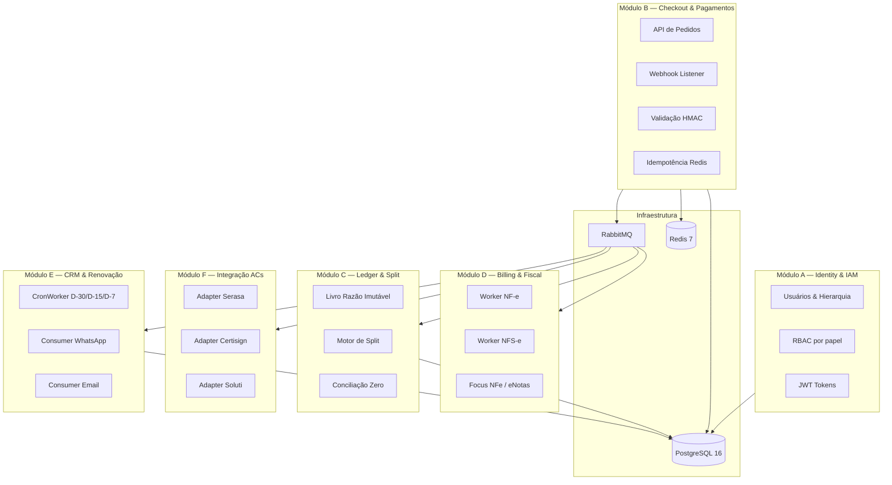
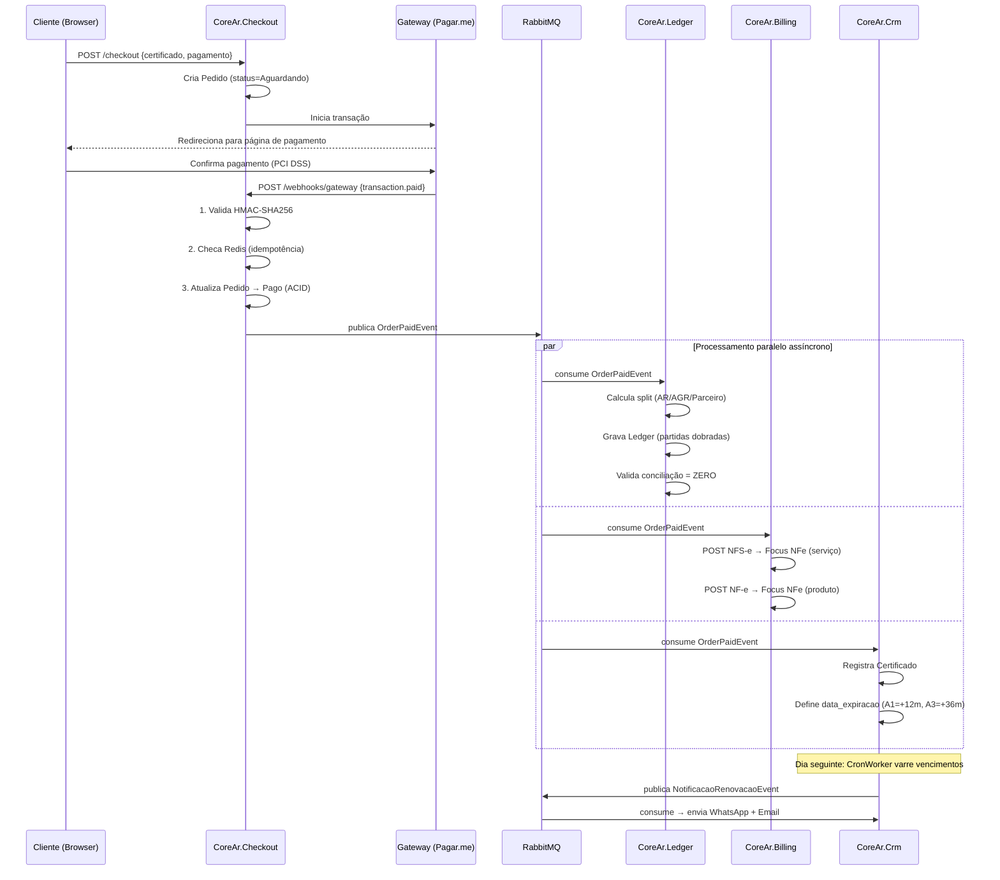
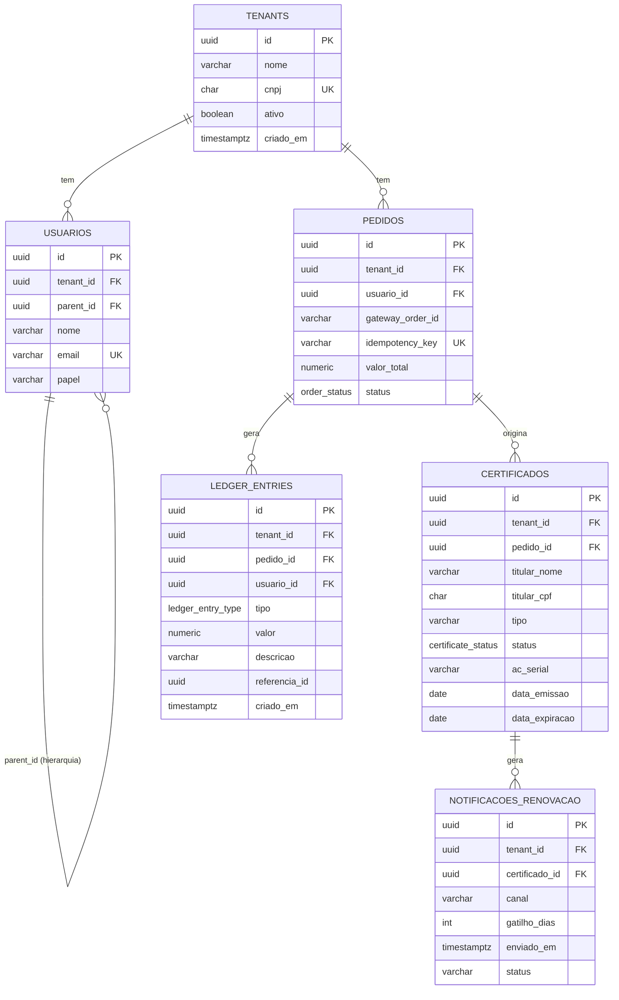
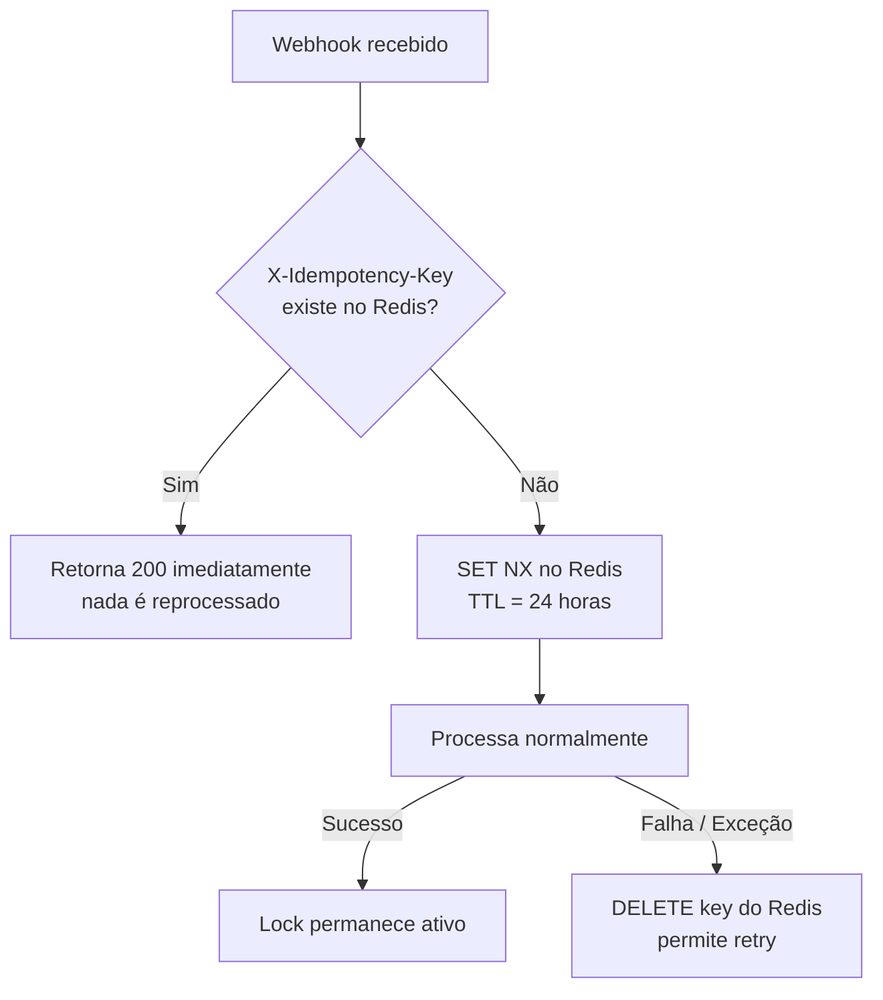

# Arquitetura — CORE-AR

> Documento técnico de referência para engenheiros e novos membros do time.

---

## Sumário

- [Padrão Arquitetural](#padrão-arquitetural)
- [Bounded Contexts (Módulos)](#bounded-contexts-módulos)
- [Fluxo de Eventos de Domínio](#fluxo-de-eventos-de-domínio)
- [Modelo de Dados](#modelo-de-dados)
- [Multitenancy e Isolamento](#multitenancy-e-isolamento)
- [Camadas de Segurança](#camadas-de-segurança)
- [Motor de Split — Partidas Dobradas](#motor-de-split--partidas-dobradas)
- [Idempotência](#idempotência)
- [Workers Assíncronos](#workers-assíncronos)
- [Decisões Arquiteturais (ADRs)](#decisões-arquiteturais-adrs)

---

## Padrão Arquitetural

O CORE-AR adota um **Monolito Modular com Event-Driven Architecture (EDA)**.

### Por que Monolito Modular (e não Microsserviços)?

Microsserviços exigem maturidade operacional elevada: observabilidade distribuída, gestão de contratos de API entre serviços e complexidade de deploy. Para uma AR em crescimento, o custo operacional é proibitivo.

O Monolito Modular oferece o melhor dos dois mundos:

| Característica | Monolito Modular (CORE-AR) | Microsserviços |
|---|---|---|
| Deploy | Um único artefato | N pipelines independentes |
| Complexidade operacional | Baixa | Alta |
| Isolamento de domínio | Via namespaces + eventos | Via rede + contratos API |
| Refatoração para microsserviços | Possível no futuro | Já é |
| Transações ACID cross-módulo | Nativas | Requires Saga Pattern |

### Princípio de Acoplamento

> **Regra de Ouro**: Nenhum módulo importa classes de outro módulo diretamente.
> A comunicação é **exclusiva via eventos** publicados no RabbitMQ.

```
❌ PROIBIDO:
  CoreAr.Billing chama CoreAr.Ledger.SplitService.CalcularSplit()

✅ CORRETO:
  CoreAr.Checkout publica OrderPaidEvent no RabbitMQ.
  CoreAr.Ledger consome e calcula o split.
  CoreAr.Billing consome e emite as notas.
```

---

## Bounded Contexts (Módulos)



---

## Fluxo de Eventos de Domínio



---

## Modelo de Dados



---

## Multitenancy e Isolamento

O isolamento entre ARs (tenants) é implementado em **duas camadas complementares**:

### Camada 1 — Aplicação (C#)

Antes de qualquer query, o middleware injeta o `tenant_id` da sessão JWT:

```csharp
// Executado em toda requisição autenticada
await connection.ExecuteAsync(
    "SET app.tenant_id = @tenantId",
    new { tenantId = currentUser.TenantId });
```

### Camada 2 — Banco de Dados (RLS)

Mesmo que o código esqueça o `WHERE tenant_id = X`, o PostgreSQL rejeita:

```sql
-- Policy aplicada em TODAS as tabelas sensíveis
CREATE POLICY tenant_isolation ON pedidos
    USING (tenant_id = current_setting('app.tenant_id')::UUID);

-- O banco rejeita silenciosamente rows de outros tenants
-- SELECT * FROM pedidos → retorna APENAS rows do tenant da sessão
```

### Por que duas camadas?

- A **camada de aplicação** é a defesa principal (performance).
- O **RLS** é o *backstop* — a última linha de defesa que garante isolamento mesmo com bug no código.

---

## Camadas de Segurança

```
Internet
    │
    │  HTTPS/TLS
    ▼
[Cloudflare WAF]          ← Bloqueia SQLi, XSS, DDoS, bots maliciosos
    │
    ▼
[API Gateway / Load Balancer]
    │
    ▼
[CoreAr.Checkout API]
    │
    ├── 1. JWT Bearer Token (Auth0/Keycloak)
    │      └── Valida assinatura RSA, expiration, audience
    │
    ├── 2. Webhook HMAC-SHA256
    │      └── CryptographicOperations.FixedTimeEquals()
    │         (anti timing-attack)
    │
    ├── 3. Idempotência Redis
    │      └── SET NX — operação atômica
    │         (anti dupla-cobrança)
    │
    └── 4. RLS PostgreSQL
           └── tenant_isolation policy
              (anti cross-tenant data leak)
```

---

## Motor de Split — Partidas Dobradas

O Ledger implementa o princípio contábil de **Partidas Dobradas** onde para cada transação:

> **Total de Débitos = Total de Créditos** → Saldo Líquido = **ZERO**

### Exemplo: Pedido de R$ 1.000,00 com contrato 70/10/20

```
Conta          | Tipo   | Valor
─────────────────────────────────────────
Pedido #XYZ    | DÉBITO | R$ 1.000,00   ← Saída do caixa do pedido
Parceiro João  | CRÉD.  | R$   200,00   ← 20%
AGR Nordeste   | CRÉD.  | R$   100,00   ← 10%
AR São Paulo   | CRÉD.  | R$   700,00   ← 70%
─────────────────────────────────────────
LÍQUIDO                   R$     0,00   ✅ CONCILIADO
```

### Regra do Penny (Arredondamento)

Em divisões com casas decimais, o centavo residual **sempre vai para a AR**:

```csharp
// Parceiro e AGR calculados com arredondamento padrão bancário
var valorParceiro = Math.Round(valorTotal * 0.333m, 4, MidpointRounding.AwayFromZero);
var valorAgr      = Math.Round(valorTotal * 0.333m, 4, MidpointRounding.AwayFromZero);

// AR recebe o residual para garantir que Créditos == Débitos
var valorAr = valorTotal - valorParceiro - valorAgr; // ← sem arredondamento
```

---

## Idempotência

Gateways de pagamento reenviam webhooks. Sem proteção, o mesmo pagamento seria processado múltiplas vezes.



---

## Workers Assíncronos

### Consumer de Notas Fiscais (CoreAr.Billing)

```
Fila: billing.emitir-notas
DLQ:  billing.emitir-notas.dlq  ← falhas vão aqui para análise manual

Fluxo:
  1. Recebe mensagem (prefetchCount=1 → processa um por vez)
  2. Emite NFS-e (serviço) e NF-e (produto) em PARALELO (Task.WhenAll)
  3. BasicAck somente após ambos com sucesso
  4. BasicNack (requeue=false) → DLQ em caso de erro
```

### CronWorker de Vencimentos (CoreAr.Crm)

```
Execução: 1x por dia (BackgroundService)
Gatilhos: D-30, D-15, D-7

Query utiliza índice composto:
  idx_cert_expiracao_status ON certificados(status, data_expiracao)
  WHERE status = 'Ativo'                    ← Partial index (só Ativos)

Deduplicação:
  NOT EXISTS (SELECT 1 FROM notificacoes_renovacao
              WHERE certificado_id = c.id
              AND gatilho_dias = @dias
              AND status = 'Enviado')       ← Não envia duas vezes
```

---

## Decisões Arquiteturais (ADRs)

### ADR-001: Monolito Modular vs. Microsserviços

**Decisão**: Monolito Modular  
**Razão**: Custo operacional de microsserviços é injustificável para o estágio atual. A arquitetura modular permite extração por bounded context no futuro sem refatoração total.

### ADR-002: NUMERIC(19,4) vs. BIGINT (centavos)

**Decisão**: `NUMERIC(19,4)` no PostgreSQL, `decimal` no C#  
**Razão**: O tipo `NUMERIC` do Postgres implementa aritmética de precisão arbitrária (sem ponto flutuante). O BIGINT exigiria conversão em toda camada de apresentação e divide mal em percentuais fracionados (como 33.33%).

### ADR-003: Ledger Imutável vs. Tabela de Saldo

**Decisão**: Ledger com partidas dobradas imutável  
**Razão**: Uma tabela "saldo" é um ponto único de falha — uma race condition pode corromper o valor. O Ledger permite auditoria completa, recálculo de saldo em qualquer ponto no tempo e é o padrão de sistemas bancários de produção.

### ADR-004: RabbitMQ (local) pronto para SQS (cloud)

**Decisão**: RabbitMQ para dev/staging; interface abstrai para SQS em produção  
**Razão**: Docker Compose com RabbitMQ acelera o desenvolvimento local. O uso de interfaces (`IOrderEventPublisher`) garante troca de implementação sem alterar código de domínio.
